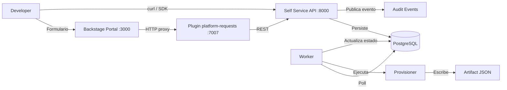
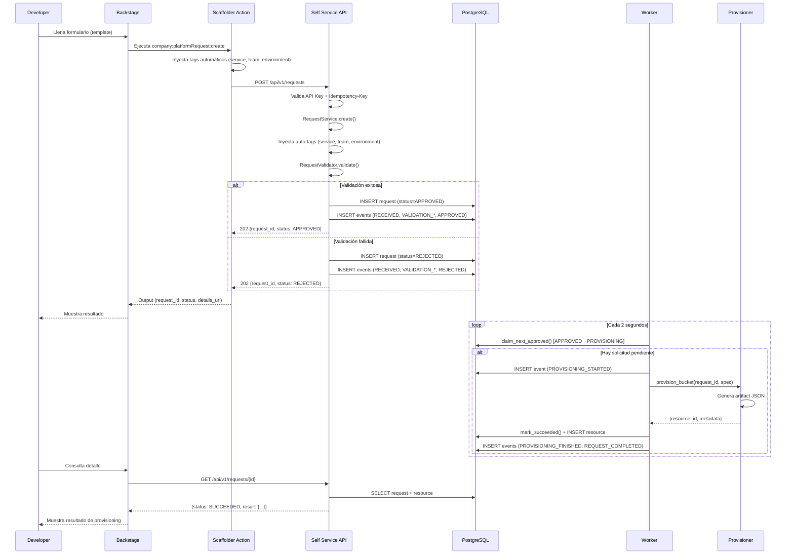
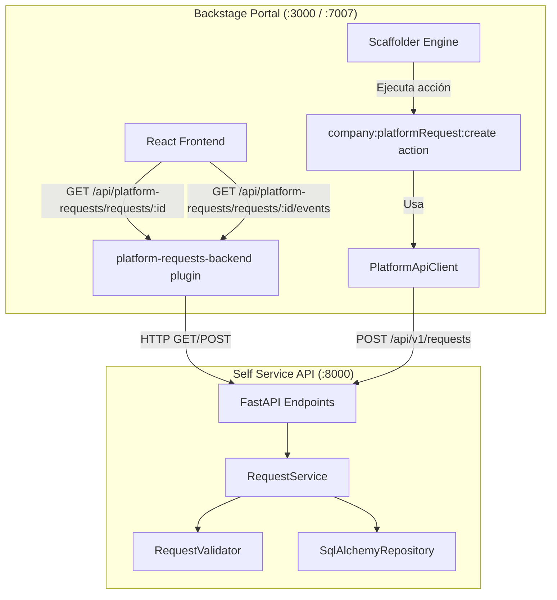
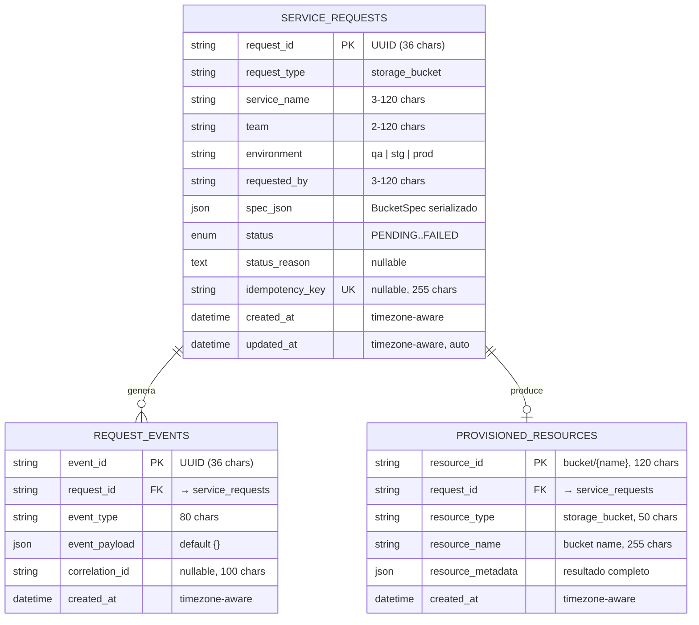
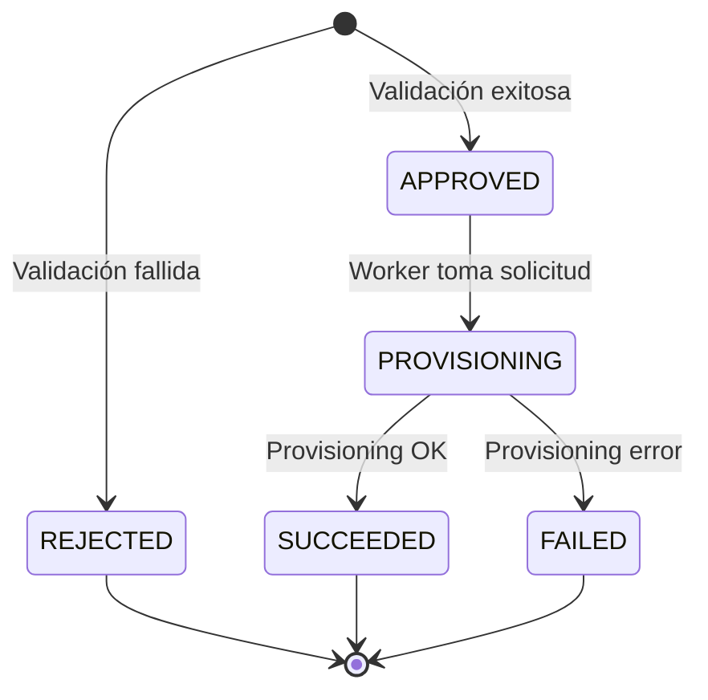
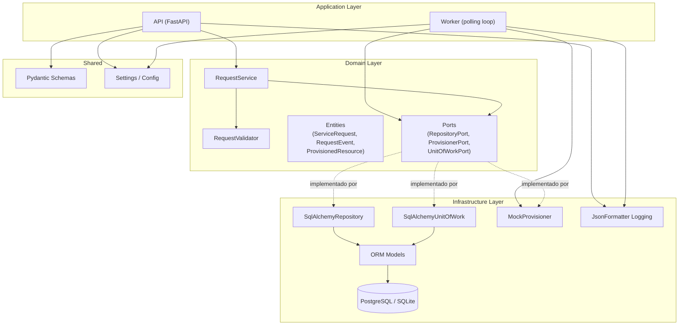
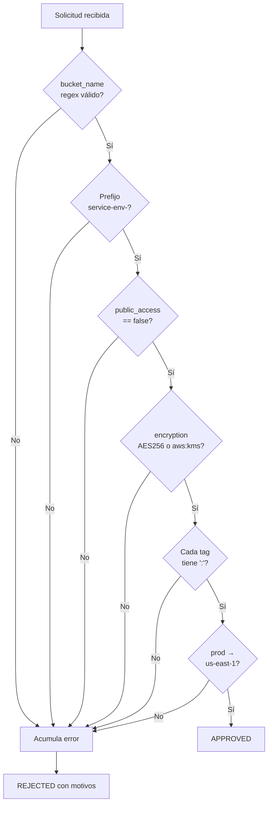
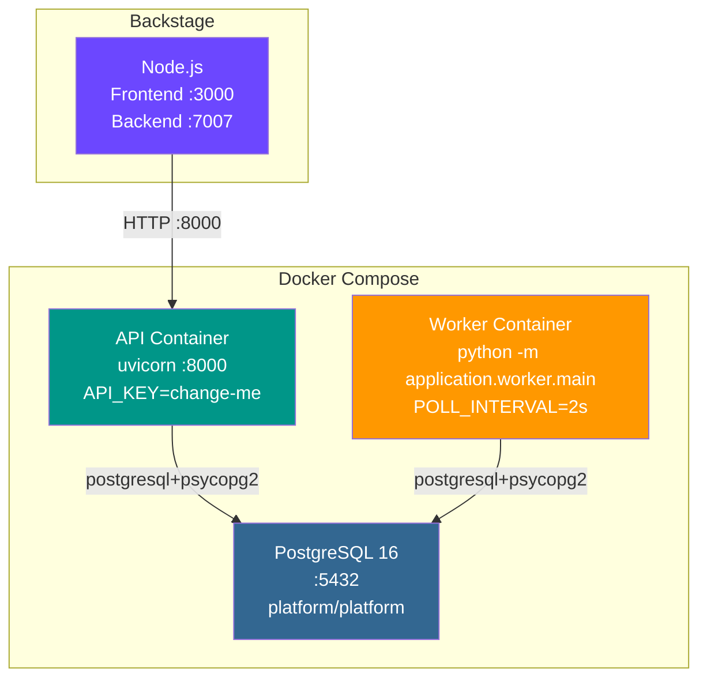

# Diseño de la Solución — Platform Self Service

## 1. Contexto y Problema

Un developer necesita solicitar la habilitación de recursos técnicos (ej: bucket S3) sin depender de intervención manual del equipo de plataforma. La solución debe recibir solicitudes, validar reglas, orquestar aprovisionamiento, registrar evidencia y devolver un estado consumible por otros sistemas o una interfaz interna.

## 2. Visión General

La solución se compone de dos sistemas:

- **Self Service API** (Python/FastAPI): backend que recibe, valida, persiste y aprovisiona solicitudes de forma asíncrona.
- **Platform Portal** (TypeScript/Backstage): portal web que actúa como interfaz para developers, consumiendo la API mediante plugins propios.



## 3. Diseño de Integración

### 3.1 Flujo completo de una solicitud



### 3.2 Integración Backstage ↔ Self Service API



**Contrato de autenticación:**

| Componente | Header | Valor |
|------------|--------|-------|
| Backstage → API | `x-api-key` | Configurado en `platformRequests.auth.secret` |
| Backstage → API | `Idempotency-Key` | Opcional, enviado por el router |
| Backstage → API | `X-Correlation-Id` | Generado automáticamente si ausente |

### 3.3 Configuración de integración (`app-config.yaml`)

```yaml
platformRequests:
  baseUrl: http://localhost:8000      # URL del Self Service API
  auth:
    headerName: x-api-key             # Nombre del header de autenticación
    secret: change-me                 # API key compartida
```

## 4. Diseño de Estructuras de Datos

### 4.1 Modelo Entidad-Relación



### 4.2 Estados y transiciones



| Estado | Descripción | Siguiente |
|--------|-------------|-----------|
| `APPROVED` | Validación exitosa, pendiente de provisioning | `PROVISIONING` |
| `REJECTED` | Validación fallida (estado terminal) | — |
| `PROVISIONING` | Worker en proceso de creación del recurso | `SUCCEEDED` / `FAILED` |
| `SUCCEEDED` | Recurso creado exitosamente (estado terminal) | — |
| `FAILED` | Error en provisioning (estado terminal) | — |

### 4.3 Eventos de auditoría

Cada solicitud genera una secuencia de eventos que constituye un trail de auditoría completo:

| Evento | Payload | Momento |
|--------|---------|---------|
| `REQUEST_RECEIVED` | `{request_type, service_name}` | Al recibir la solicitud |
| `VALIDATION_STARTED` | `{request_type}` | Antes de validar |
| `VALIDATION_FINISHED` | `{is_valid, errors}` | Resultado de validación |
| `REQUEST_APPROVED` | `{next_status: "APPROVED"}` | Si validación exitosa |
| `REQUEST_REJECTED` | `{reason: [...]}` | Si validación fallida |
| `PROVISIONING_STARTED` | `{request_type}` | Worker inicia provisioning |
| `PROVISIONING_FINISHED` | `{resource_id, provisioner}` | Provisioning exitoso |
| `PROVISIONING_FAILED` | `{error}` | Error en provisioning |
| `REQUEST_COMPLETED` | `{final_status}` | Estado terminal alcanzado |

### 4.4 Esquema del payload de solicitud (`BucketSpec`)

```json
{
  "request_type": "storage_bucket",
  "service_name": "payments-api",
  "team": "platform-payments",
  "environment": "qa",
  "requested_by": "johan.gomez",
  "spec": {
    "bucket_name": "payments-api-qa-artifacts",
    "region": "us-east-1",
    "versioning": true,
    "encryption": "AES256",
    "public_access": false,
    "tags": [
      "team:platform-payments",
      "data_classification:internal"
    ]
  }
}
```

### 4.5 Esquema del artefacto de provisioning

El provisioner genera un archivo JSON en `artifacts/{request_id}.json`:

```json
{
  "resource_id": "bucket/payments-api-qa-artifacts",
  "bucket_name": "payments-api-qa-artifacts",
  "region": "us-east-1",
  "versioning": true,
  "encryption": "AES256",
  "public_access": false,
  "tags": ["service:payments-api", "team:platform-payments", "environment:qa"],
  "provisioned_at": "2026-03-25T00:00:00+00:00",
  "provisioner": "mock"
}
```

## 5. Diseño de API REST

### 5.1 Endpoints

```
                    ┌──────────────────────────────────────────┐
                    │          Self Service API :8000           │
                    ├──────────────────────────────────────────┤
                    │                                          │
  Health ──────────►│  GET  /health              → 200         │
  Readiness ──────►│  GET  /ready               → 200         │
                    │                                          │
  Crear ──────────►│  POST /api/v1/requests     → 202 / 200   │
  Listar ─────────►│  GET  /api/v1/requests     → 200         │
  Detalle ────────►│  GET  /api/v1/requests/:id → 200 / 404   │
  Auditoría ──────►│  GET  /api/v1/requests/:id/events → 200  │
                    │                                          │
                    └──────────────────────────────────────────┘
```

### 5.2 Contrato de respuestas

**POST /api/v1/requests → 202 (nueva) / 200 (idempotente)**
```json
{
  "request_id": "uuid",
  "status": "APPROVED",
  "message": "Request accepted and approved for provisioning"
}
```

**GET /api/v1/requests → 200**
```json
{
  "items": [
    {
      "request_id": "uuid",
      "request_type": "storage_bucket",
      "service_name": "payments-api",
      "team": "platform-payments",
      "environment": "qa",
      "requested_by": "johan.gomez",
      "status": "SUCCEEDED",
      "status_reason": null,
      "spec": { "..." },
      "resource_id": "bucket/payments-api-qa-artifacts",
      "result": { "..." },
      "created_at": "2026-03-25T00:00:00Z",
      "updated_at": "2026-03-25T00:00:10Z"
    }
  ],
  "limit": 20,
  "offset": 0
}
```

**GET /api/v1/requests/:id/events → 200**
```json
{
  "items": [
    {
      "event_id": "uuid",
      "event_type": "REQUEST_RECEIVED",
      "event_payload": {"request_type": "storage_bucket"},
      "correlation_id": "corr-abc",
      "created_at": "2026-03-25T00:00:00Z"
    }
  ],
  "total": 6,
  "limit": 50,
  "offset": 0
}
```

## 6. Diseño de Arquitectura por Capas



**Principios aplicados:**

| Principio | Implementación |
|-----------|----------------|
| Separación de responsabilidades | Domain no depende de infraestructura; usa puertos abstractos |
| Dependency Inversion | `RepositoryPort` y `ProvisionerPort` son interfaces abstractas |
| Unit of Work | Transacciones explícitas con commit/rollback |
| Adapter Pattern | `MockProvisioner` implementa `ProvisionerPort`, reemplazable por Terraform/SDK |
| Idempotencia | `Idempotency-Key` con constraint único en BD |
| Vertical Slice | Un caso completo (storage_bucket) end-to-end |

## 7. Reglas de Validación



## 8. Diseño de Despliegue



## 9. Seguridad

| Control | Implementación |
|---------|----------------|
| Autenticación | API Key vía header `x-api-key` (configurable) |
| Validación de entrada | Pydantic con constraints de tipo, largo y formato |
| Idempotencia | Header `Idempotency-Key` con constraint único en BD |
| Cifrado obligatorio | `encryption` debe ser `AES256` o `aws:kms` |
| Acceso público bloqueado | `public_access=false` enforced por validación |
| No secrets en código | Variables de entorno + `python-dotenv` |
| Trazabilidad | `X-Correlation-Id` propagado en toda la cadena |
| Restricción regional | `prod` solo permite `us-east-1` |

## 10. Observabilidad

| Componente | Implementación |
|------------|----------------|
| Logging estructurado | JSON con campos: `timestamp`, `level`, `message`, `request_id`, `correlation_id`, `stage`, `status` |
| Correlation ID | Generado automáticamente o recibido vía header, propagado a eventos |
| Health check | `GET /health` — liveness probe |
| Readiness check | `GET /ready` — valida conexión a BD |
| Audit trail | Tabla `request_events` con cada transición de estado consultable vía API |
| Artefactos | JSON en `artifacts/{request_id}.json` como evidencia del provisioning |